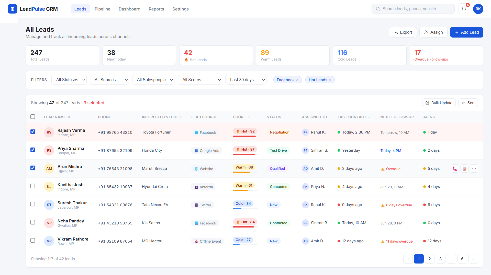
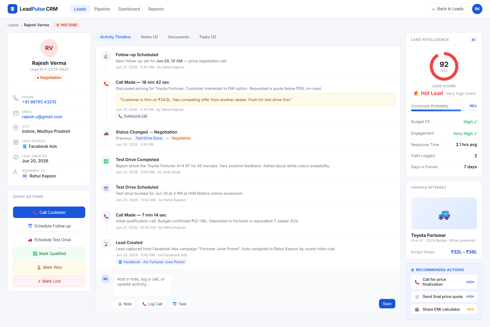
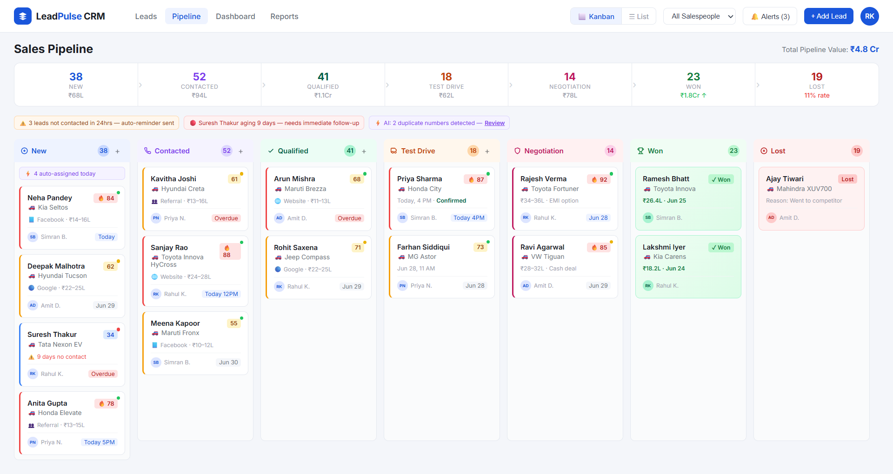
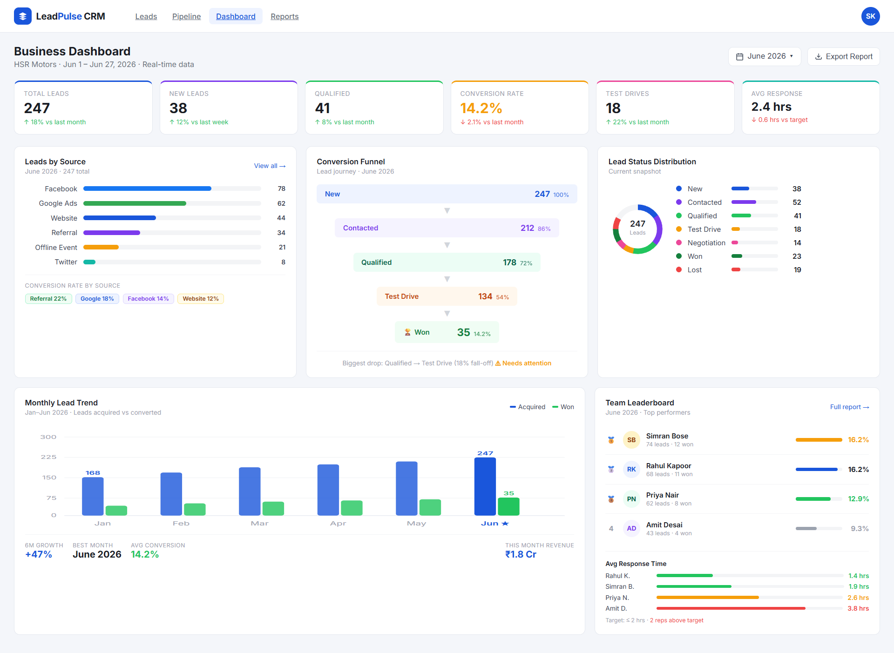

# LeadPulse CRM – Product Case Study

## Overview

LeadPulse CRM is a lead management platform designed for HSR Motors, a car dealership that receives leads from multiple channels including Facebook, Google, Twitter, Website Forms, Referrals, and Offline Events.

The objective of the platform is to replace spreadsheet-based lead tracking with a centralized CRM system that improves collaboration, lead conversion, and business visibility.

---

## Problem Statement

HSR Motors currently manages leads using spreadsheets, which creates several operational challenges:

* Lack of real-time collaboration
* Missed follow-ups
* No lead prioritization
* Limited reporting capabilities
* Poor visibility into sales performance

---

## Users

### Sales Team

* Manage assigned leads
* Schedule follow-ups
* Track customer interactions
* Update lead status

### Business Manager

* Monitor team performance
* Analyze lead sources
* Track conversion funnels
* Identify bottlenecks

---

## Key Features

### Lead Listing

* Advanced filtering and search
* Lead scoring
* Lead aging indicators
* Bulk updates

### Lead Details

* Customer profile
* Activity timeline
* Call history
* Follow-up tracking

### Lead Management Pipeline

* Kanban-based workflow
* Drag-and-drop lead progression
* Pipeline visibility
* Collaboration support

### Business Dashboard

* Conversion funnel
* Lead source analytics
* Team leaderboard
* Performance trends

---

## Smart Automation Features

* AI Lead Scoring
* Smart Follow-up Reminders
* Duplicate Lead Detection
* Next Best Action Recommendations

---

## User Flow

Lead Created → Assigned → Contacted → Qualified → Test Drive → Negotiation → Won / Lost

---

## Screens

### Lead Listing

### Lead Details

### Lead Management Pipeline

### Business Dashboard

---

## Tools Used

* Figma
* Product Design
* UX Research
* Workflow Design
* Dashboard Design

---

## Author

Kabir Singh Khair

B.Tech, IIITDM Jabalpur
